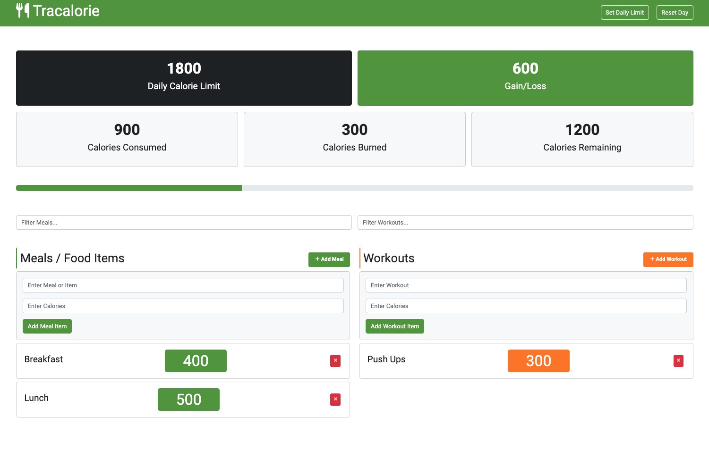

# calorieCounterApp

A simple web app built using HTML5 , CSS3 and JavaScript .
This is a simple calorie counter app built with vanilla JavaScript. It tracks your meals and workouts and calculates the total calories burned and consumed.

All of the code/classes are in the `app.js` file.
